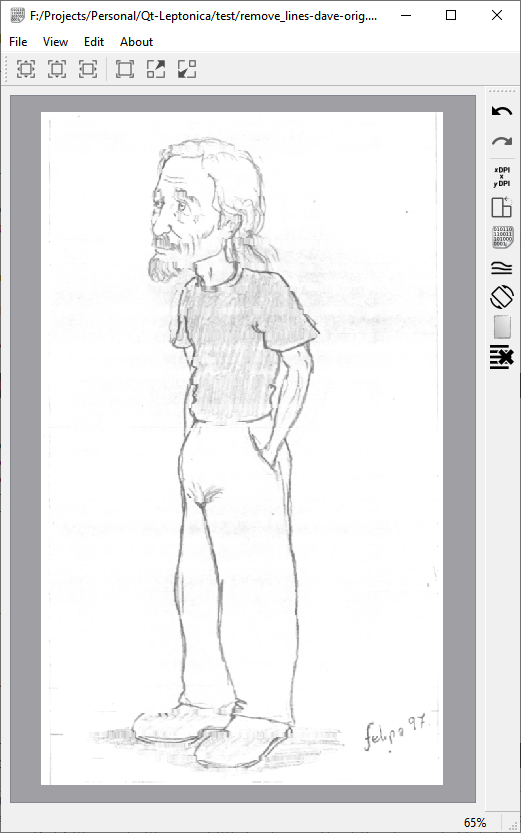

# About
Qt Leptonica is a simple fun C++ project to learn Qt5 and to test Leptonica library. Contribution and code improvements are welcomed.



# Install

## Requirements

* [cmake](https://cmake.org/) (qmake support abandoned)
* [Leptonica](https://github.com/DanBloomberg/leptonica)
* [Qt5](https://www.qt.io/download-open-source) (Qt6 not tested, Qt4 no supported)

## Windows

### Install Leptonica

Follow instructions on [Leptonica wiki](https://github.com/DanBloomberg/leptonica/wiki#windows)

### Build Qt Leptonica

Set `PATH` to Qt and Leptonica installation

```sh
set QTDIR=f:/Qt/5.15.2/msvc2019_64
set LEPTONICA=C:/Projects/win64
set PATH=%QTDIR%/bin;%LEPTONICA%/bin;%PATH%
```

```
rm -Rf build/*
cmake -G "Visual Studio 16 2019" -A x64 -S . -B build -DCMAKE_PREFIX_PATH="%QTDIR%;%LEPTONICA%"
cmake --build build --config Release --verbose
copy build\Release\Qt-leptonica.exe %LEPTONICA%
```
